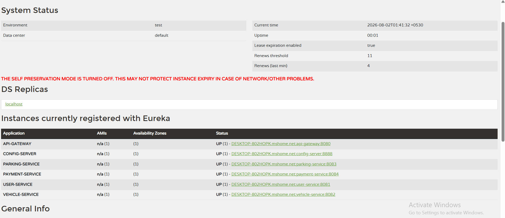

# Project Name - Smart Parking Management System (SPMS)

## Resources
- [Postman Collection](./postman_collection)
- 

### Each module is a build and run them individually in this order

   1. Eureka Server      → http://localhost:8761
   2. Config Server      → http://localhost:8888
   3. API Gateway        → http://localhost:8080
   4. User Service       → http://localhost:8081
   5. Vehicle Service    → http://localhost:8082
   6. Parking Service    → http://localhost:8083
   7. Payment Service    → http://localhost:8084

### User Service (`/api/users`)

      POST      | `/api/users/register`    
      POST      | `/api/users/login`       
      GET       | `/api/users`             
      GET       | `/api/users/{id}`        
      PUT       | `/api/users/{id}`        
      DELETE    | `/api/users/{id}`        
      GET       | `/api/users/{id}/history`
      POST      | `/api/users/{id}/history`

### Vehicle Service (`/api/vehicles`)
 
      POST      | `/api/vehicles`             
      GET       | `/api/vehicles`             
      GET       | `/api/vehicles/{id}`        
      GET       | `/api/vehicles/user/{userId}`
      PUT       | `/api/vehicles/{id}`        
      DELETE    | `/api/vehicles/{id}`        
      POST      | `/api/vehicles/{id}/entry`  
      POST      | `/api/vehicles/{id}/exit`   
      GET       | `/api/vehicles/{id}/tracking`

### Parking Service (`/api/parking`)

      POST      | `/api/parking`                  
      GET       | `/api/parking?city=&zone=&availableOnly=`
      GET       | `/api/parking/{id}`             
      GET       | `/api/parking/owner/{ownerId}`  
      PUT       | `/api/parking/{id}`             
      DELETE    | `/api/parking/{id}`             
      POST      | `/api/parking/{id}/reserve`     
      POST      | `/api/parking/{id}/release`     
      PATCH     | `/api/parking/{id}/status`      

### Payment Service (`/api/payments`)

      POST      | `/api/payments`               
      GET       | `/api/payments`               
      GET       | `/api/payments/{id}`          
      GET       | `/api/payments/user/{userId}`
      GET       | `/api/payments/receipt/{receiptNumber}`